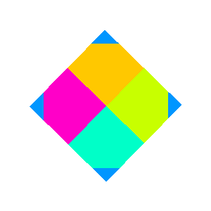
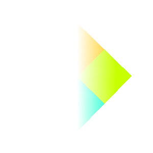

# The retro n-gon renderer
A minimalist 3d software renderer that draws n-sided polygons (as well as lines and points) onto a user-supplied HTML5 canvas. Its intended use cases are chiefly those where a minimalist retro aesthetic is preferred.

You can view an interactive sample of the renderer's output [here](https://www.tarpeeksihyvaesoft.com/s/retro-ngon/samples/tomb-raider-home/) (interaction requires a mouse and keyboard; click on the page to engage mouse lock). This renders a scene from the PC game *Tomb Raider* in which you can move around using the mouse and keyboard (the ESDF keys, specifically).

A non-interactive render sample is also available [here](https://www.tarpeeksihyvaesoft.com/s/retro-ngon/samples/textured-cube-model/). It produces a spinning texture-mapped cube.


### Features
- Straightforward API
- Genuine retro aesthetics
- Optional pixel and vertex shaders
- Vanilla JavaScript with no dependencies

### Projects using the retro n-gon renderer
- [RallySportED-js](https://github.com/leikareipa/rallysported-js/), a contemporary asset editor for the DOS game Rally-Sport

### Suggested use cases
The retro n-gon renderer is not intended as a general-purpose software 3d renderer. It omits many modern features in favor of a legit retro look and feel.

I have a number of other open-source software renderer projects also, some of which might fit your needs or interests better:
- [Wray](https://github.com/leikareipa/wray/) for path tracing in JavaScript
- [Vond](https://github.com/leikareipa/vond/), a low-res hybrid voxel/polygon software renderer in C++
- [Vond Jr.](https://github.com/leikareipa/vond-jr/) is a Java version of Vond
- [Kelpo](https://github.com/leikareipa/kelpo/), an up-coming C89-based retro-themed minimalism-oriented 3D API wrapper for Win32 (Windows 95, 98, ...) with support for Direct3D, OpenGL, Glide, and others.
- [dccb](https://github.com/leikareipa/dccb/)'s is a simple software renderer in C for 16-bit DOS

The retro n-gon renderer encourages low resolutions, very low polycounts, and designing your way around technical limitations &ndash; like in the old days of software rendering. You might use the renderer for some of the following purposes:
- Engagement in feature minimalism
- Retro 3d games with sparse, simple environments
- Visualizing 3d models in an old-fashioned manner

# Screenshots
\
**A scene** from Tomb Raider 1 as rendered by the retro n-gon renderer and consisting of textured quads and triangles. (Based on assets produced by Core Design for *Tomb Raider*. Core Design is not associated with the retro n-gon renderer.)

\
**Level E1M1** from Quake 1 rendered with a per-pixel lighting shader. (Based on textures and 3d models produced by id Software for *Quake*; id Software is not associated with the retro n-gon renderer.)

\
**The track** editor view in RallySportED-js, with geometry built from texture-mapped, wireframed quads. (Based on textures and 3d models produced by Jukka Jäkälä for *Rally-Sport*. Jukka Jäkälä is not associated with the retro n-gon renderer.)

\
**A view** of the race track at Rouen in Grand Prix Legends. (Based on textures and 3d models produced by Papyrus Design Group for *Grand Prix Legends*. Papyrus Design Group is not associated with the retro n-gon renderer.)

\
**Vertex lighting** with Gouraud interpolation in a scene from Tomb Raider 1. (Based on assets produced by Core Design for *Tomb Raider*. Core Design is not associated with the retro n-gon renderer.)


**Depth-based** blurring applied with a pixel shader. (See [here](samples/pixel-shaders/assets/textures/copying.txt) for texture copyright information.)

# User's manual
In this section, you'll find both theoretical and practical guidance on using the retro n-gon renderer; including a reference manual for the renderer's API.

Contents:
- [Introduction and intro tutorial](#introduction-and-intro-tutorial)
    - [The gist of it in theory](#the-gist-of-it-in-theory)
    - [Rendering a quad, in practice](#rendering-a-quad-in-practice)
    - [Rendering a textured quad](#rendering-a-textured-quad)
    - [Giving the quad a spin](#giving-the-quad-a-spin)
    - [Adding pixelation](#adding-pixelation)
    - [Creating pixel shaders for extra visual effects](#creating-pixel-shaders-for-extra-visual-effects)
    - [More examples](#more-examples)
- [Creating and rendering 3d models](#creating-and-rendering-3d-models)
    - [N-gons](#n-gons)
    - [Meshes](#meshes)
    - [Models](#models)
    - [Exporting models from Blender](#exporting-models-from-blender)
    - [Texturing](#texturing)
- [API reference](#api-reference)

## Introduction and intro tutorial
### The gist of it in theory
At the heart of the renderer is the `render()` function, which transforms and rasterizes a set of n-gons onto a HTML5 canvas. You call it with the HTML id of the canvas you want the image rendered into, an array of the n-gon meshes you want rendered, and additional, optional parameters to define the position of the camera, etc.

The following pseudocode outlines the basic program flow for rendering an n-gon onto a canvas element:
```
// Create the canvas element to render into.
<canvas id="the-canvas" style="width: 100px; height: 100px;"></canvas>

// Create the n-gon, and wrap it in a mesh for rendering.
ngon = Rngon.ngon(...)
mesh = Rngon.mesh([ngon])

// Render the n-gon mesh onto the canvas.
Rngon.render("the-canvas", [mesh], {options})
```

Getting a bit ahead of ourselves, it's worth noting that you don't need to hand-code 3d models out of individual n-gons, either: you can also export models directly from Blender. You'll learn more about it in later sections of this document; but for now, the following pseudocode gives you a feel for how you would render a Blender-exported model called `scene`:
```
// Load the exported model file.
<script src="scene.js"></script>

// Initialize the model for rendering. This will load in any textures, as well.
await scene.initialize()

// Create a mesh of the model. We can then render it with render(), as we did above.
const mesh = Rngon.mesh(scene.ngons)
```

### Rendering a quad, in practice
The following code first constructs a HTML5 canvas element to render into, using CSS to set the size of the rendering to 300 x 300 pixels. It then creates an n-gon quad (i.e. a 4-gon), wraps it up in a mesh, and asks the renderer to draw the mesh onto the canvas. Note also that the mesh is given a 45-degree rotation, the renderer's camera is moved back by 5 units, and the quad is colored blue.
```
<canvas id="canvas" style="width: 300px; height: 300px; background-color: rgba(0, 0, 0, .05);"></canvas>
<script src="distributable/rngon.cat.js"></script>
<script>
    const quad = Rngon.ngon([Rngon.vertex(-1, -1, 0),
                             Rngon.vertex( 1, -1, 0),
                             Rngon.vertex( 1,  1, 0),
                             Rngon.vertex(-1,  1, 0)],
                            {
                                color: Rngon.color_rgba(0, 150, 255)
                            })

    const quadMesh = Rngon.mesh([quad],
                                {
                                    rotation: Rngon.rotation_vector(0, 0, 45)
                                })

    Rngon.render("canvas", [quadMesh],
                 {
                     cameraPosition: Rngon.translation_vector(0, 0, -5),
                     scale: 1
                 })
</script>
```


### Rendering a textured quad
Textures are a staple of 3d rendering, so let's add one. The code below is otherwise the same as above, but additionally creates a `texture` object and appends it to the quad's material property. You'll learn more about textures later in this document, but for right now, the details don't need worrying about. Just know that this is roughly how textures are added to n-gons. Since the base color of an n-gon also modifies the color of its texture, we set the color to white instead of blue, as we don't want the texture to be tinted blue, here.
```
<canvas id="canvas" style="width: 300px; height: 300px; background-color: rgba(0, 0, 0, .05);"></canvas>
<script src="distributable/rngon.cat.js"></script>
<script>
    const texture = Rngon.texture_rgba({width: 2, height: 2, pixels: [255, 200, 0, 255,
                                                                      200, 255, 0, 255,
                                                                      255, 0, 200, 255,
                                                                      0, 255, 200, 255]})

    const quad = Rngon.ngon([Rngon.vertex(-1, -1, 0),
                             Rngon.vertex( 1, -1, 0),
                             Rngon.vertex( 1,  1, 0),
                             Rngon.vertex(-1,  1, 0)],
                            {
                                color: Rngon.color_rgba(255, 255, 255),
                                texture: texture
                            })

    const quadMesh = Rngon.mesh([quad],
                                {
                                    rotation: Rngon.rotation_vector(0, 0, 45)
                                })

    Rngon.render("canvas", [quadMesh],
                 {
                     cameraPosition: Rngon.translation_vector(0, 0, -5),
                     scale: 1
                 })
</script>
```


You might notice that the texture hasn't rotated with the quad: its lines are perpendicular to the horizon, while the quad's run diagonally, having been rotated by 45 degrees. This is an artefact of the renderer's default texture-mapping mode. You can learn more about the texturing modes further down, but for now, we can fix this by choosing a more suitable mode.

The code below modifies the `quad` object given above to add UV texture coordinates to the quad's vertices, and the `affine` texture-mapping mode to the quad's material property. With these changes, the renderer will rotate the texture in sync with the quad.
```
    const quad = Rngon.ngon([Rngon.vertex(-1, -1, 0, 0, 0),
                             Rngon.vertex( 1, -1, 0, 1, 0),
                             Rngon.vertex( 1,  1, 0, 1, 1),
                             Rngon.vertex(-1,  1, 0, 0, 1)],
                            {
                                color: Rngon.color_rgba(255, 255, 255),
                                texture: texture,
                                textureMapping: "affine",
                                uvWrapping: "clamp"
                            })
```


### Giving the quad a spin
With a few simple additions, we can modify the code so far to add a spinning animation to the quad. We'll do this by repeatedly calling `render()` in sync with the device's refresh rate via `window.requestAnimationFrame()`, and for each frame wrapping the quad in a new mesh with a slightly increased rotation value. (The retro n-gon renderer favors immutable data, which is why we're creating the mesh object from scratch each frame, rather than modifying the rotation of an existing mesh. Although note that since alpha.5 and later versions, the renderer has now begun moving away from immutable structures, for reasons of performance.)
```
<canvas id="canvas" style="width: 300px; height: 300px; background-color: rgba(0, 0, 0, .05);"></canvas>
<script src="distributable/rngon.cat.js"></script>
<script>
    const texture = Rngon.texture_rgba({width: 2, height: 2, pixels: [255, 200, 0, 255,
                                                                      200, 255, 0, 255,
                                                                      255, 0, 200, 255,
                                                                      0, 255, 200, 255]})

    const quad = Rngon.ngon([Rngon.vertex(-1, -1, 0, 0, 0),
                             Rngon.vertex( 1, -1, 0, 1, 0),
                             Rngon.vertex( 1,  1, 0, 1, 1),
                             Rngon.vertex(-1,  1, 0, 0, 1)],
                            {
                                color: Rngon.color_rgba(255, 255, 255),
                                texture: texture,
                                textureMapping: "affine",
                                uvWrapping: "clamp"
                            })

    const rotatingQuad = (frameCount)=>
    {
        const rotationSpeed = 0.6;
        return Rngon.mesh([quad],
                          {
                              rotation: Rngon.rotation_vector(0, 0, 45 + (frameCount * rotationSpeed))
                          });
    };

    (function render_loop(frameCount = 0)
    {
        Rngon.render("canvas", [rotatingQuad(frameCount)],
        {
            cameraPosition: Rngon.translation_vector(0, 0, -5),
            scale: 1
        })

        window.requestAnimationFrame(()=>render_loop(frameCount + 1));
    })();
</script>
```

### Adding pixelation
In the examples above, the renderer's pixel size is 1:1 with the output resolution, so there is no visible pixelation that one might expect from a retro style. Not to worry, though, as the degree of pixelation can be controlled via the `scale` property provided to `render()`. What happens if we set it to, say, 0.14?
```
Rngon.render("canvas", [rotatingQuad(frameCount)],
             {
                 cameraPosition: Rngon.translation_vector(0, 0, -5),
                 scale: 0.14
             })
```


Setting the `scale` property to a value less than 1 causes the pixel size to be upscaled by the inverse of the property's value &ndash; in this case, by 1 / 0.14 &asymp; 7. In other words, you get chunky pixels, while the display size remains the same.

One thing to be aware of is that, under the hood, the upscaling is done by the browser and not by the retro n-gon renderer. This will typically result in a blurry image, as you see on the left. To have the browser upscale without blur, add `image-rendering: pixelated` to the canvas's CSS:
```
<canvas id="canvas" style="width: 300px;
                           height: 300px;
                           background-color: rgba(0, 0, 0, .05);
                           image-rendering: pixelated;"></canvas>
```

This will result &ndash; with certain browsers, like Chrome &ndash; in the clean upscaling you see in the second image, above. Not all browsers, especially older versions of them, support this syntax, however, and may require one of the following variations:
```
image-rendering: -moz-crisp-edges;    /* For Firefox*/
image-rendering: -o-crisp-edges;      /* For Opera*/
image-rendering: -webkit-crisp-edges; /* For Safari*/
```

### Creating pixel shaders for extra visual effects
Pixel shaders allow you to add a variety of visual effects to your renderings, from simple 2d pixel manipulation to complex 3d lighting and more.

To enable the renderer's shader functionality, we need to pass a shader function to `render()` via its `pixelShaderFunction` property. Like so:

```
Rngon.render("...", [...],
             {
                 pixelShaderFunction: sample_shader,
             })

function sample_shader({renderWidth, renderHeight, fragmentBuffer, pixelBuffer, ngonCache, cameraPosition})
{
    ...
}
```

The renderer will call the shader function once all n-gons have been rasterized but before the rasterized image is drawn onto the screen &ndash; the idea being that the shader function gets to modify the rasterized pixel data before it is shown to the user.

The shader function receives as parameters the render resolution, the rasterized pixel data, some metadata in the fragment buffer about the state of the renderer at each rasterized pixel, the n-gons &ndash; transformed into screen space &ndash; that were rasterized, and the position &ndash; in world XYZ coordinates &ndash; of the camera.

The following is a simple shader to make every pixel in the rendering blue:

```
function sample_shader({renderWidth, renderHeight, pixelBuffer})
{
    for (let i = 0; i < (renderWidth * renderHeight); i++)
    {
        pixelBuffer[(i * 4) + 0] = 0;
        pixelBuffer[(i * 4) + 1] = 150;
        pixelBuffer[(i * 4) + 2] = 255;
        pixelBuffer[(i * 4) + 3] = 255;
    }
}
```

The shader iterates over all of the pixels in the rasterized image (RGBA, so four elements per pixel), setting their color to red:0, green:150, blue:255, and alpha:255. Once the function returns, the renderer will draw the modified pixel buffer onto the canvas, which presents as a solid blue image. The two pictures below show the rendering before and after applying the shader.


Although we've done so above, a shader doesn't normally need to explicitly set the alpha channel of a pixel, since any rasterized pixel will already have its alpha set to 255 by default. However, in the above example, where we render only a quad with nothing in the background, the unrendered background pixels have an alpha of 0 and will thus not be visible unless we manually assign them a more opaque value.

To demonstrate that pixels with a default alpha of 0 are indeed part of the background, the following shader colors blue all pixels whose alpha is 0:

```
function sample_shader({renderWidth, renderHeight, pixelBuffer})
{
    for (let i = 0; i < (renderWidth * renderHeight); i++)
    {
        if (pixelBuffer[(i * 4) + 3] === 0)
        {
            pixelBuffer[(i * 4) + 0] = 0;
            pixelBuffer[(i * 4) + 1] = 150;
            pixelBuffer[(i * 4) + 2] = 255;
            pixelBuffer[(i * 4) + 3] = 255;
        }
    }
}
```


With simple pixel shaders like these, you can create various effects like grayscaling, blurring and sharpening. However, by accessing the extra information passed to our shader &ndash; the fragment buffer and the n-gon cache &ndash; we can write even more powerful shaders!

For example, to color only one corner of our quad blue, we can use the fragment buffer's texture coordinates to identify the desired region on the quad's face, then color in only those pixels whose texture coordinates are within that region:

```
function sample_shader({renderWidth, renderHeight, pixelBuffer, fragmentBuffer})
{
    for (let i = 0; i < (renderWidth * renderHeight); i++)
    {
        const thisFragment = fragmentBuffer[i];

        if (thisFragment &&
            thisFragment.textureU < 0.25 &&
            thisFragment.textureV > 0.75)
        {
            pixelBuffer[(i * 4) + 0] = 0;
            pixelBuffer[(i * 4) + 1] = 150;
            pixelBuffer[(i * 4) + 2] = 255;
        }
    }
}
```


Each of the fragment buffer's elements is an object that contains render-related information about a corresponding rasterized pixel; e.g. `fragmentBuffer[x]` provides information about the pixel in `pixelBuffer[x * 4]`. For a list of the properties available in the fragment buffer, see [js/retro-ngon/retro-ngon.js](js/retro-ngon/retro-ngon.js) &ndash; these include interpolated world coordinates, surface normals, texture coordinates, etc.

Shaders can also use the n-gon cache to get information about the rasterized polygons. The following shader colors blue any corner of the quad whose vertex coordinates are within a certain distance of the corresponding screen pixel:

```
function sample_shader({renderWidth, renderHeight, fragmentBuffer, pixelBuffer, ngonCache})
{
    for (let y = 0; y < renderHeight; y++)
    {
        for (let x = 0; x < renderWidth; x++)
        {
            const thisFragment = fragmentBuffer[x + y * renderWidth];
            const thisNgon = (thisFragment? ngonCache[thisFragment.ngonIdx] : null);

            if (!thisNgon)
            {
                continue;
            }

            for (let v = 0; v < thisNgon.vertices.length; v++)
            {
                if ((Math.abs(x - Math.round(thisNgon.vertices[v].x)) < 20) &&
                    (Math.abs(y - Math.round(thisNgon.vertices[v].y)) < 20))
                {
                    pixelBuffer[((x + y * renderWidth) * 4) + 0] = 0;
                    pixelBuffer[((x + y * renderWidth) * 4) + 1] = 150;
                    pixelBuffer[((x + y * renderWidth) * 4) + 2] = 255;
                }
            }
        }
    }
}
```




In the above shader, we use the fragment buffer's 'ngonIdx' property to find which of the n-gon cache's polygons a given pixel is part of. Once we know that, we can directly access that n-gon's public properties.

The following shader uses the fragment buffer's XYZ world coordinates to apply an alpha fading effect. It exploits the fact that this particular quad's world coordinates are always in the range [-1, 1], using them as an alpha multiplier:

```
function sample_shader({renderWidth, renderHeight, pixelBuffer, fragmentBuffer})
{
    for (let i = 0; i < (renderWidth * renderHeight); i++)
    {
        const thisFragment = fragmentBuffer[i];

        if (thisFragment)
        {
            const alpha = Math.max(0, Math.min(1, thisFragment.worldX));
            pixelBuffer[(i * 4) + 3] = (alpha * 255);
        }
    }
}
```




Unlike the 2d screen-space vertex coordinates of the n-gon cache, the fragment buffer's world coordinates give you the corresponding 3d world position of any given rasterized pixel. This is rather powerful, as it allows you to e.g. compute per-pixel 3d lighting.

Overall, pixel shaders let you create a variety of effects, from simple 2d pixel manipulation to complex 3d per-pixel lighting and more. Get creative and see what effects you can make happen!

That said, a downside of shaders is that you pay a price for them in performance: even a slightly complex shader can readily halve your FPS. A basic trick is to limit yourself to relatively lower resolutions when using shaders.

### More examples
The [samples/](samples/) directory contains various examples of the renderer in action.

## Creating and rendering 3d models
### N-gons
The building-block of 3d models in the retro n-gon renderer is the n-gon. It's a polygon of _n_ sides (_n_-gon), or a line (2-gon), or a single point (1-gon). An n-gon is made up of one or more vertices, and a material that describes how the n-gon should look when rendered (its color, texture, and so on).

A red triangle, for instance, could be created like so:
```
const ngon = Rngon.ngon([Rngon.vertex(0, 0, 0),
                         Rngon.vertex(1, 0, 0),
                         Rngon.vertex(1, 1, 0)],
                        {
                            color: Rngon.color_rgba(255, 0, 0),
                        })
```
Here, we define the three vertices of the triangle, and specify the `color` property of its material. Note that the vertices are passed as an array that can include an arbitrary number of them &ndash; three to make a triangle, four to make a quad, and so on.

The following are valid properties of an n-gon's material, and the valid values of each property, separated by the | symbol:
```
{
    color: Rngon.color_rgba(...)
    texture: Rngon.texture_rgba(...)
    textureMapping: "ortho" | "affine"
    hasWireframe: true | false
    isTwoSided: true | false
    wireframeColor: Rngon.color_rgba(...)
    auxiliary: {}
}
```

The `color` property sets the n-gon's base color. If the n-gon has no texture, its entire face will be rendered with the base color. If it has a texture, the colors of the texture will be modulated by the base color.

The `texture` property sets the n-gon's texture. You can read more about texturing further down this document.

The `textureMapping` property defines how textures should be mapped onto the n-gon's face. You can read more about texturing further down this document.

The `hasWireframe` property determines whether a line should be drawn around the n-gon's face.

The `isTwoSided` property determines whether the n-gon should be visible when viewed from behind (relative to the direction of its surface normal). If set to true, you must also provide the n-gon with a valid surface normal, which otherwise defaults to an *up*-vector of {x:0, y:1, z:0}.

The `wireframeColor` property sets the color of the n-gon's wireframe. Note that if `hasWireframe` is false, no wireframe will be drawn, regardless of its color.

The `auxiliary` property defines an object containing properties to which auxiliary render buffers have read access.

### Meshes
To render n-gons, you first wrap them in a mesh. Meshes are collections of n-gons that share a purpose; for instance, the n-gons that make up a model of a spoon. A mesh thus consists of an array one or more n-gons, and a particular set of 3d transformations that affect the mesh's n-gons in unison.

A mesh containing one triangle rotated by 45 degrees and moved by 11 units along an axis could be created like so:
```
const triangle = Rngon.ngon([Rngon.vertex(0, 0, 0),
                             Rngon.vertex(1, 0, 0),
                             Rngon.vertex(1, 1, 0)])

const mesh = Rngon.mesh([triangle],
                        {
                            rotation: Rngon.rotation_vector(45, 0, 0),
                            translation: Rngon.translation_vector(11, 0, 0),
                        })
```

The following are valid properties of a mesh's set of transformations, and the valid values of each property:
```
{
    rotation: Rngon.rotation_vector(...)
    translation: Rngon.translation_vector(...)
    scaling: Rngon.scaling_vector(...)
}
```
The `rotation` property sets the amount, in degrees between 0 and 359, of rotation of the mesh's n-gons along each of the three axes.

The `translation` property moves the mesh's n-gons to the given location. This is in addition to the n-gons' local coordinates; such that if an n-gon's vertex is located at x = 10, and you translate the n-gon's mesh by 10 on x, that vertex's new location will be x = 20.

The `scaling` property scales each of the mesh's n-gons by the given amount along each of the three axes.

If both translation and rotation are defined, the rotation will be applied first.

### Models
Meshes and n-gons are the retro n-gon renderer's native objects. Models, on the other hand, are an interface between these native objects and external 3d assets.

For instance, when you create a 3d scene in Blender and export it using the retro n-gon renderer's Blender export script (more of which in the sections, below), you get a model: a JavaScript file whose code, after some processing to load any assets from disk etc., returns an array of n-gons corresponding to the original scene's polygons. Something like the following:
```
const scene =
{
    ngons:[],
    initialize: async function()
    {
        // ...Load textures, set up materials, etc.

        this.ngons = Object.freeze(
        [
            // ...Create the model's n-gons.
        ]);
    }
}
```

The `scene` object (though it could be called anything) contains the `ngons` array of n-gons, and the `initialize()` function, which populates the `ngons` array. Assuming the object is contained in a file called `scene.js`, we could render it like so:
```
<script src="distributable/rngon.cat.js"></script>
<script src="scene.js"></script>
<canvas id="canvas" style="width: 300px; height: 300px;"></canvas>
<script>
    (async ()=>
    {
        await scene.initialize()
        const sceneMesh = Rngon.mesh(scene.ngons)
        Rngon.render("canvas", [sceneMesh])
    })()
</script>
```

### Exporting models from Blender
You can use the free 3d modeling program, [Blender](https://www.blender.org/), to create 3d assets for use with the retro n-gon renderer. A script to export scenes from Blender into the retro n-gon renderer's format is provided under [tools/conversion/](tools/conversion/).

At the moment, the Blender export script is quite rudimentary, and doesn't necessarily allow for a convenient asset workflow. Nonetheless, with certain precautions as discussed below, it allows you to create 3d scenes in Blender using native n-gons, and to import the results directly for use with the retro n-gon renderer.

To export a scene from Blender, simply load up the export script file in Blender, and run it. The exact way to load Python scripts into Blender will depend on your version of Blender &ndash; if you're uncertain, just have a look on Google for the specifics, but know that it's not a complicated process.

At the moment, the script exports vertex coordinates, vertex UV coordinates, each material's diffuse color and its intensity, and, if any, the filename of the texture image in each material's first texture slot. Objects that are hidden will not be exported. Normals are ignored. You should first apply any pending transformations to the objects (Object > Apply in Blender's menu) before running export script, as any unapplied transformations will be ignored. The same goes for any other modifiers that have not yet been applied.

If you are not planning on using depth buffering in your rendering, you may need to subdivide larger polygons to prevent them from incorrectly occluding other nearby geometry. Without depth buffering, the renderer will average a polygon's depth information across its face into one value &ndash; which will become a less accurate approximation of the polygon's depth as its area grows. On the other hand, when depth buffering is enabled, the renderer will use per-pixel depth interpolation, which will be accurate for larger polygons as well as smaller ones.

Once the file has been exported, it's likely that you'll have to make a few edits to it by hand. Texture filenames, for instance, will probably need to be given correct paths. If you have unused textures or materials in Blender, they will nonetheless also be exported, and may require manual deletion from the file (or, perhaps ideally, from Blender, so that they don't get exported in the first place).

As the retro n-gon renderer expects textures to be in its custom JSON format, you'll want to convert any textures to that format, first, and also adjust their filenames accordingly in the exported file. You'll find more information about converting textures, below.

### Texturing
Examples of the basics of texturing were given earlier in the documentation. Now, you'll find out about all the details.

Each n-gon can have one texture applied to it. To apply a texture to an n-gon, assign it as the n-gon's `texture` material property:
```
const someTexture = Rngon.texture_rgba(...)

const ngon = Rngon.ngon([...],
                        {
                            texture: someTexture
                        })
```

By default, you don't need to provide UV coordinates for the n-gon's vertices for texturing to work. The texture will be mapped onto the n-gon's face disregarding its orientation, so no UV are needed. Depending on the n-gon's orientation, this mapping can result in texture-warping, however, as shown below.

 

The texture-mapping mode can be changed via the n-gon's `textureMapping` material property, which by default is `ortho` and behaves as described above. The second mode is `affine` &ndash; it requires UV coordinates, but will eliminate texture warp in many cases. In the two images, below, `ortho` mapping is shown on the left, and `affine` mapping on the right.

 

The difference in performance between `ortho` and `affine` mapping should be negligible, but you can test for your target platforms using [tests/performance/perftest1.html](tests/performance/perftest1.html).

The texture for an n-gon's material is created using the `texture_rgba()` function. It takes as input an object specifying the texture's width, height, pixel data, and certain optional properties. The following code creates a red 1 x 1 texture:
```
const texture = Rngon.texture_rgba({width:1,
                                    height:1,
                                    pixels:[255, 0, 0, 0]})
```

In this example, the `pixels` property is an array of raw 8-bit color values, four per pixel for RGBA. Note that the retro n-gon renderer's alpha is either fully opaque (255) or fully transparent (any value but 255); there is no intermediate blending.

The texture's pixel data can also be provided as a Base64-encoded string, with 16 bits per pixel (5 bits for RGB each and 1 bit for alpha). The same example as above but with Base64-encoded pixel data would be like so:
```
const texture = Rngon.texture_rgba({width:1,
                                    height:1,
                                    channels:"rgba:5+5+5+1",
                                    encoding:"base64",
                                    pixels:"H4A="})
```

When using Base64-encoded pixel data, the `encoding` property must be set to "base64". The `channels` property must be "rgba:5+5+5+1".

The benefit of using Base64 encoding &ndash; in tandem with 16-bit color &ndash; is a notable reduction in file size. The reduced color depth causes some degradation in color fidelity, true, but given the renderer's low fidelity overall (low resolutions and polycounts), it's likely not going be visually disruptive in many cases.

A simple PHP script for converting PNG images into the retro n-gon renderer's JSON format is provided under [tools/conversion/](tools/conversion/).

If your JSON texture data is stored in a JSON file rather than as a JavaScript object, you can create a texture from it by calling  the `texture_rgba.create_with_data_from_file()` function. It returns a Promise of a texture, resolved once the file has been loaded and a texture created from its data. The following code creates a texture from a JSON file:
```
(async ()=>
{
    const texture = await Rngon.texture_rgba.create_with_data_from_file("file.json")

    // Safe to use the texture here, it's finished loading.
})()
```

Be aware, however, that `texture_rgba.create_with_data_from_file()` uses the Fetch API, which typically requires the content to be served via a server rather than from a local file directly. If you want to use this functionality locally, you can set up a server on localhost &ndash; e.g. by executing `$ php -S localhost:8000` in the retro n-gon renderer's root &ndash; and then accessing the code's HTML via `localhost:8000/*`.

## API reference
The renderer's public API consists of the following objects:

| Object                                          | Brief description                           |
| ----------------------------------------------- | ------------------------------------------- |
| [render](#rendercanvaselementid-meshes-options) | Renders n-gon meshes into a canvas.         |
| [mesh](#meshngons-transform)                    | Collection of thematically-related n-gons.  |
| [ngon](#ngonvertices-material-normal)           | Polygonal shape defined by *n* vertices.    |
| [vertex](#vertexx-y-z-u-v-w)                    | Corner of an n-gon.                         |
| [vector3](#vector3x-y-z)                        | Three-component vector. Aliases: *translation_vector*, *rotation_vector*, *scaling_vector*. |
| [color_rgba](#color_rgbared-green-blue-alpha)   | RGB color with alpha.                       |
| [texture_rgba](#texture_rgbadata)               | RGB texture with alpha.                     |
| light                                           | (A description is coming.)                                   |

### render(canvasElementId[, meshes[, options]])
Renders one or more n-gon meshes onto an existing canvas element.

*Parameters:*

| Type      | Name            | Description |
| --------- | --------------- | ----------- |
| *string*  | canvasElementId | A string matching the *id* attribute of the DOM canvas element to render into. |
| *array*   | meshes          | An array of one or more **mesh** objects to be rendered. Defaults to *[Rngon.mesh()]* (an empty mesh). |
| *object*  | options         | An object providing optional directives. |

*The **options** parameter object recognizes the following properties:*

| Type                  | Name                     | Description |
| --------------------- | ------------------------ | ----------- |
| *number*              | scale                    | The resolution of the rendering relative to the size of the target canvas. For instance, a scale of 0.5 would result in rendering an image half the resolution of the target canvas. Values below 1 will see the rendered image upscaled to fit the canvas, while values above 1 result in downscaling. The CSS property *image-rendering* on the target canvas can be used to set the type of post-render scaling - f.e. *image-rendering: pixelated* will on some browsers result in pixelated rather than blurred scaling. Defaults to *1*. |
| *number*              | fov                      | Field of view. Defaults to *43*. |
| *string*              | depthSort                | Type of depth sorting to use when ordering n-gons for rasterization. Possible values: "none" (no depth sorting; n-gons will be rendered in the order they were given), "painter" (painter's algorithm; n-gons furthest from the camera will be rendered first), "painter-reverse" (n-gons closest to the camera will be rendered first). If the *useDepthBuffer* option is true, "painter-reverse" may provide the best performance, as this combination allows for early rejection of occluded pixels. Defaults to *"painter-reverse"*. |
| *boolean*             | useDepthBuffer           | If true, a depth buffer will be used during rasterization to discard occluded pixels. For best performance, consider combining depth buffering with the "painter-reverse" *depthSort* option. Defaults to *true*. |
| *boolean*             | hibernateWhenNotOnScreen | If true, rendering will be skipped if the target canvas is not at least partially within the current viewport. Defaults to *true*. |
| *number*              | nearPlane                | Distance from the camera to the near plane. Vertices closer to the camera will be clipped. Defaults to *1*.|
| *number*              | farPlane                 | Distance from the camera to the far plane. Vertices further from the camera will be clipped. Defaults to *1000*.|
| *number*              | perspectiveCorrectInterpolation | When set to true, any properties that are linearly interpolated between vertices (e.g. texture coordinates) will be perspective-corrected. This results in less view-dependent distortion, but will reduce performance to some extent. Defaults to *false*.|
| *boolean*             | clipToViewport           | If set to true, the renderer will clip all n-gons against the viewport prior to rendering. If none of your n-gons extend beyond the screen's boundaries, setting this to false may save you some performance. Defaults to *true*. |
| *translation_vector*  | cameraPosition           | The camera's position. Defaults to *vector3(0, 0, 0)*. |
| *rotation_vector*     | cameraDirection          | The camera's direction. Defaults to *vector3(0, 0, 0)*. |
| *array*               | auxiliaryBuffers         | One or more auxiliary render buffers. Each buffer is an object containing the properties *buffer* and *property*; where *buffer* points to an array containing as many elements as there are pixels in the rendering, and *property* names a source property in an n-gon's material. For each pixel rendered, the corresponding element in an auxiliary buffer will be written with the n-gon's material source value. Defaults to *[]*. |
| *function*            | pixelShaderFunction      | A function that will be called once all of the frame's n-gons have been rasterized but before the rasterized image is drawn on screen. The function takes as its only parameter an object containing the following: {renderWidth, renderHeight, fragmentBuffer, pixelBuffer, ngonCache}. The pixel buffer contains the RGBA color values of the rasterized image; the fragment buffer corresponding metadata about each rasterized pixel (like its interpolated texture and world coordinates); and the n-gon cache the transformed n-gons that were rasterized (including e.g. their material properties). With this information, the function can apply shader effects to the RGBA pixel buffer. Setting this property to *null* will fully disable shader functionality. Defaults to *null*.  |
| *array*              | lights          | An array of **light** objects that defines the scene's light sources. The way in which these lights affect a given n-gon is controlled by the n-gon's 'vertexShading' material property. Defaults to *[]*.  |

*Returns:*

```
{
    renderWidth,
    renderHeight,

    // The total count of n-gons rendered. May be smaller than the number of n-gons
    // originally submitted for rendering, due to visibility culling etc. performed
    // during the rendering process.
    numNgonsRendered,

    // The total time this call to render() took, in milliseconds.
    totalRenderTimeMs,
}
```

*Sample usage:*

```
// Create a mesh out of a single-vertex n-gon, and render it into a canvas.

const ngon = Rngon.ngon([Rngon.vertex(0, 0, 0)]
                        {
                            color: Rngon.color_rgba(255, 255, 0),
                        });

const mesh = Rngon.mesh([ngon],
                        {
                            rotation: Rngon.rotation_vector(0, 0, 45)
                        });

Rngon.render("canvas", [mesh],
             {
                 cameraPosition: Rngon.translation_vector(0, 0, 0),
             });
```

```
// Employ an auxiliary render buffer for mouse picking.

const ngon = Rngon.ngon([Rngon.vertex(0, 0, 0)]
                        {
                            color: Rngon.color_rgba(255, 255, 0),

                            // The 'auxiliary' property holds sub-properties that are available to auxiliary buffers.
                            auxiliary:
                            {
                                // A value that uniquely identifies this n-gon.
                                mousePickingId: 5,
                            }
                        });

const mousePickingBuffer = [];

Rngon.render("canvas", [Rngon.mesh([ngon])],
             {
                 cameraPosition: Rngon.translation_vector(0, 0, 0),
                 auxiliaryBuffers:
                 [
                     {buffer: mousePickingBuffer, property: "mousePickingId"},
                 ],
             });

// The 'mousePickingBuffer' array now holds the rendered n-gon's 'mousePickingId' value wherever the n-gon is visibile in the rendered image.
```

### mesh([ngons[, transform]])
A collection of thematically-related n-gons, rendered as a unit with shared transformations.

*Parameters:*

| Type      | Name            | Description |
| --------- | --------------- | ----------- |
| *array*   | ngons           | An array of one or more **ngon** objects, which define the mesh's geometry. Defaults to *[Rngon.ngon()]*. |
| *object*  | transform      | An object whose properties define the transformations to apply on the mesh's n-gons prior to rendering. |

*The **transform** parameter object recognizes the following properties:*

| Type                 | Name            | Description |
| -------------------- | --------------- | ----------- |
| *translation_vector* | translation     | The amount by and direction in which to displace the mesh's n-gons. This is in addition to the n-gons' local coordinates; such that if an n-gon's vertex is located at x = 10, and the mesh it belongs to is translated by 10 on x, the vertex's new location will be x = 20. Defaults to *translation_vector(0, 0, 0)*. |
| *rotation_vector*    | rotation        | The amount of rotation, in degrees 0-359, to apply to each of the mesh's n-gons. Defaults to *rotation_vector(0, 0, 0)*.<br><br>NOTE: The rotation is not applied to the n-gons' surface normals. If you require the surface normals to respect the mesh's rotation, the rotation must be applied - e.g. in your 3d editor of choice - prior to importing the mesh into the renderer, and no further rotation should be requested via this property. |
| *scaling_vector*     | scaling         | The amount by which to scale each of the mesh's n-gons along each of the three axes. Defaults to *scaling_vector(1, 1, 1)*. |

*Note:* If both *translation* and *rotation* are given, the rotation will be applied first.

*Returns:*

```
{
    rotation: transform.rotation,
    translation: transform.translation,
    scale: transform.scaling,

    // The array of n-gons passed as an argument into the function.
    ngons,
})
```

*Sample usage:*

```
// Construct a mesh containing one n-gon, and apply rotation and scaling to it.

const ngon = Rngon.ngon([Rngon.vertex(0, 0, 0)]);

const mesh = Rngon.mesh([ngon],
                        {
                            rotation: Rngon.rotation_vector(20, 0, 0),
                            scaling: Rngon.scaling_vector(10, 15, 5),
                        });
```

### ngon([vertices[, material[, normal]]])
An n-gon &ndash; a shape defined by *n* vertices; typically a triangle or a quad.

*Parameters:*

| Type      | Name            | Description |
| --------- | --------------- | ----------- |
| *array*   | vertices        | An array of one or more **vertex** objects, which define the corners of the n-gon. Defaults to *[vertex()]*. |
| *object*  | material       | An object whose properties define the n-gon's material. Will be combined with the *ngon.defaultMaterial* object such that any colliding parameters are overridden by this object. Defaults to *{}*. |
| *vector3*  | normal       | A surface normal defining the direction of the n-gon's face. Defaults to *vector3(0, 1, 0)* &ndash; a vector pointing up.<br><br>NOTE: Surface normals do not react to rotation applied to the n-gon's **mesh** object. They are therefore best used for static meshes. |

*The **material** parameter object recognizes the following properties:*

| Type                 | Name            | Description |
| -------------------- | --------------- | ----------- |
| *color_rgba*         | color           | Defines the n-gon's base color. If the n-gon has no texture, its entire face will be rendered in this color. If the n-gon has a texture, the colors of the texture will be multiplied by (x / 255), where *x* is the corresponding color channel of the base color. Defaults to *color_rgba(255, 255, 255, 255)*. |
| *mixed*              | texture         | Gives the n-gon's texture as a **texture_rgba** object; or, if null, the n-gon will be rendered without a texture. Defaults to *null*. |
| *string*             | textureMapping  | Defines how textures (if any) should be mapped onto the n-gon's surface during rendering. Possible values: "ortho" (view-dependent mapping without UV), "affine" (UV mapping). If set to "ortho", vertices do not need UV coordinates, but visual distortions will be introduced in many cases. The "affine" mapping mode requires vertices to have UV coordinates, but results in more visually-accurate mapping. Defaults to *"ortho"*. |
| *string*             | uvWrapping  | Controls how the texture sampler should interpret UV coordinates. Possible values: "clamp" (UV coordinates are clamped to [0,1-ϵ], or [-ϵ,-1] if negative values are given), "repeat" (discards the coordinate's integer part and repeats the texture). Defaults to *"repeat"*. |
| *boolean*            | hasWireframe    | If true, the n-gon will be rendered with a wireframe outline. Defaults to *false*. |
| *boolean*            | isTwoSided    | If true, the n-gon can be viewed from both front and back. Otherwise, the n-gon will be culled when viewed from behind, as determined by the direction of its surface normal. Defaults to *true*.<br><br>Note: Should not be set to false for n-gons that are part of a **mesh** object to which you have applied rotation. This is because surface normals ignore rotation, so applying backface culling in these cases would give an incorrect result. |
| *color_rgba*         | wireframeColor  | If the n-gon has a wireframe, this property gives the wireframe's color as a **color_rgba** object. Defaults to *color_rgba(0, 0, 0)*. |
| *array*              | auxiliary       | Properties accessible to the auxiliary buffers of **render**. Defaults to *{}*. |
| *boolean*            | allowTransform  | If true, the n-gon's vertices will be transformed into screen space prior to rasterization. Otherwise, the vertices are assumed to already be in screen space, where X,Y == 0,0 is the top left corner and X,Y == rw-1,rh-1 the bottom right corner, with rw being the render width and rh the render height; and in which case no further transformation will be performed. Defaults to *true*.<br><br>Caution: If set to false, viewport clipping will also not be performed. All vertex XY coordinates of such n-gons must be in the range [0,d-1], where d is the render width for X and render height for Y. |
| *string*             | vertexShading | Sets the type of built-in shading to be used when computing lighting from the scene's light sources (which are given by the 'lights' property). Possible values: "none" (no shading will be applied; all light sources are ignored), "flat" (each n-gon face will receive a solid shade based on the angle between incident light and the n-gon's surface normal), "gouraud" (angle-based shading will be computed separately for each vertex, using vertex normals). Defaults to *"none"*. |
| *boolean*             | renderVertexShade | Controls whether the renderer will apply vertex shading to pixels during rasterization. If set to *false*, built-in lighting will effectively be turned off. But if this is *false* and the 'vertexShading' property is *"flat"* or *"gouraud"*, shading information will still be computed and made available to e.g. pixel shaders.  Defaults to *true*. |

*Returns:*

```
{
    vertices,
    material,
    normal,        // The face normal.
    vertexNormals, // The corresponding normal for each vertex.
}
```

*Sample usage:*

```
// Construct a 4-sided n-gon (quad) with a texture applied to it.

const texture = Rngon.texture_rgba(
                {
                    width: 2,
                    height: 2,
                    pixels: [255, 200, 0, 255,
                             200, 255, 0, 255,
                             255, 0, 200, 255,
                             0, 255, 200, 255],
                });

const quad = Rngon.ngon([Rngon.vertex(-1, -1, 0),
                         Rngon.vertex( 1, -1, 0),
                         Rngon.vertex( 1,  1, 0),
                         Rngon.vertex(-1,  1, 0)],
                        {
                            color: Rngon.color_rgba(255, 255, 255),
                            texture: texture
                        });
```

### vertex([x[, y[, z[, u[, v[, w]]]]]])
One corner of an n-gon.

*Parameters:*

| Type          | Name     | Description |
| ------------- | -------- | ----------- |
| *number*      | x        | The vertex's *x* coordinate. Defaults to *0*. |
| *number*      | y        | The vertex's *y* coordinate. Defaults to *0*. |
| *number*      | z        | The vertex's *z* coordinate. Defaults to *0*. |
| *number*      | u        | The vertex's *u* texture coordinate. Defaults to *0*. |
| *number*      | v        | The vertex's *v* texture coordinate.  Defaults to *0*. |
| *number*      | w        | The vertex's *w* coordinate, for matrix transformations. Defaults to *1*. |

*Note:* In the coordinate space, *x* is horizontal (positive = right), and *y* is vertical (positive = up); positive *z* is forward. Of the texture coordinates, *u* is horizontal, and *v* is vertical.

*Returns:*

```
{
    x, y, z, w, u, v,

    // A value in the range >= 0 that defines how lit this vertex is.
    // Will be modified by built-in lighting, if enabled.
    shade,

    // The vertex's object-space coordinates. Will be set automatically
    // by the vertex transformer and made accessible to pixel shaders.
    worldX, worldY, worldZ,
}
```

*Sample usage:*

```
// Create a vertex at coordinates (1, 1, 0), and give it UV coordinates (1, 0).

const vertex = Rngon.vertex(1, 1, 0, 1, 0);
```

```
// Create an n-gon from two vertices.

const vertex1 = Rngon.vertex(1, 1, 0);
const vertex2 = Rngon.vertex(-1, -1, 0);

const ngon = Rngon.ngon([vertex1, vertex2]);
```

### vector3([x[, y[, z]]])
A three-component vector.

*Aliases:* **rotation_vector**\*, **translation_vector**, **scaling_vector**

\* Component values passed to **rotation_vector** are expected to be in units of degrees; and are automatically converted by value into the renderer's internal angle units.

*Parameters:*

| Type          | Name     | Description |
| ------------- | -------- | ----------- |
| *number*      | x        | The vector's *x* coordinate. Defaults to *0*. |
| *number*      | y        | The vector's *y* coordinate. Defaults to *0*. |
| *number*      | z        | The vector's *z* coordinate. Defaults to *0*. |

*Note:* In the coordinate space, *x* is horizontal (positive = right), and *y* is vertical (positive = up); positive *z* is forward.

*Returns:*

```
{
    x, y, z,
}
```

*Sample usage:*

```
// Create a vector (1, 2, 3).

const vector = Rngon.vector3(1, 2, 3);
```

### color_rgba([red[, green[, blue[, alpha]]]])
RGB color with alpha. The alpha channel is either fully transparent or fully opaque.

*Parameters:*

| Type          | Name  | Description |
| ------------- | ------| ----------- |
| *number*      | red   | The color's red channel. Defaults to *55*. |
| *number*      | green | The color's green channel. Defaults to *55*. |
| *number*      | blue  | The color's blue channel. Defaults to *55*. |
| *number*      | alpha | The color's alpha channel. A value of 255 is fully opaque, while a value other than 255 is fully transparent. Defaults to *255*. |

*Note:* All color channel values are to be given in the range [0, 255].

*Returns:*

```
{
    red, green, blue, alpha,

    // An object containing as properties the color channel values in the range [0, 1].
    unitRange,
}
```

### texture_rgba([data])
A texture whose pixels are RGB with alpha.

*Parameters:*

| Type          | Name  | Description |
| ------------- | ------| ----------- |
| *object*      | data  | An object whose properties provide the texture's data. Defaults to *{width:0, height:0, pixels:[]}* (an empty texture). |

*The **data** parameter object recognizes the following properties:*

| Type      | Name      | Description |
| --------- | ----------| ----------- |
| *number*  | width     | The number of pixels in the texture, horizontally. The value must be in the range [0, 32768]. If affine texture-mapping is used, textures whose dimensions are a power of two render a bit faster. |
| *number*  | height    | The number of pixels in the texture, vertically. The value must be in the range [0, 32768]. If affine texture-mapping is used, textures whose dimensions are a power of two render a bit faster. |
| *array*   | pixels    | An array containing the texture's pixels. The *encoding* property defines the encoding used for the pixel data; by default, each pixel is given as four consecutive 8-bit values (red, green, blue, alpha). |
| *string*  | encoding  | *Optional parameter.* Specifies the encoding used for data in the *pixels* array. Possible values: "none" (each pixel is given as four discrete 8-bit values), "base64" (pixels are packed integers encoded with Base64). If "base64" is specified, the bit layout of the packed pixel values must be given via the *channels* property.
| *string*  | channels  | *Optional parameter.* Will be ignored if *encoding* is not "base64". Specifies the bit layout of the data in the *pixels* array. Possible values: "rgba:5+5+5+1" (each pixel element is a 16-bit integer with 5 bits each for red/green/blue, and 1 bit for alpha). |

*Note:* The texture's data can be provided either via the *data* parameter, or through a JSON file using the `texture_rgba.create_with_data_from_file()` helper function.

*Returns:*

```
{
    width: data.width,
    height: data.height,

    // The pixels from data.pixels converted into an array of
    // elements of the form {red, green, blue, alpha}.
    pixels: pixelArray,
}
```

*Sample usage:*

```
// Create a 2-by-2 texture.

const texture = Rngon.texture_rgba(
                {
                    width: 2,
                    height: 2,
                    pixels: [255, 200, 0, 255,
                             200, 255, 0, 255,
                             255, 0, 200, 255,
                             0, 255, 200, 255],
                });
```

```
// Create a texture with data from a JSON file.

const texture = await Rngon.texture_rgba.create_with_data_from_file("texture.json");
```

```
// Create a texture whose pixels are Base64-encoded packed 16-bit integers.

const texture = Rngon.texture_rgba(
                {
                    width: 1,
                    height: 1,
                    channels: "rgba:5+5+5+1",
                    encoding: "base64",
                    pixels: "H4A=",
                });
```

# Performance
As suggested in the sections, above, the retro n-gon renderer is not intended to provide fluid rendering of high-polycount, high-resolution scenes. Rather, low resolutions and spartan scenes are its domains.

## Performance on desktop
The table below lists the results of [tests/performance/perftest1.html](tests/performance/perftest1.html) as of [de12aa8](https://github.com/leikareipa/retro-ngon/tree/de12aa8b6dd64308ac851659ac1c4da5cf437ee3) running on a Xeon E3-1230 v3 desktop PC in Chrome 79 (top value) and Firefox 72 (bottom value).

The values given are frames per second for scenes with 30, 60, ..., 960 polygons. A bullet indicates that the frame rate was at least 60, the screen's refresh rate during the tests.

<table>
    <tr>
        <td align="left" width="130">E3-1230 v3</td>
        <th align="center">30</th>
        <th align="center">60</th>
        <th align="center">120</th>
        <th align="center">240</th>
        <th align="center">480</th>
        <th align="center">960</th>
    </tr>
    <tr>
        <th align="left">Wireframe</th>
        <td align="center">&bull;</td>
        <td align="center">&bull;</td>
        <td align="center">&bull;</td>
        <td align="center">&bull;</td>
        <td align="center">&bull;</td>
        <td align="center">&bull;</td>
    </tr>
    <tr>
        <th align="left">Solid fill</th>
        <td align="center">&bull;</td>
        <td align="center">&bull;</td>
        <td align="center">&bull;</td>
        <td align="center">&bull;</td>
        <td align="center">&bull;</td>
        <td align="center">51<br>40</td>
    </tr>
    <tr>
        <th align="left">Textured</th>
        <td align="center">&bull;</td>
        <td align="center">&bull;</td>
        <td align="center">&bull;</td>
        <td align="center">&bull;</td>
        <td align="center">57<br>43</td>
        <td align="center">32<br>24</td>
    </tr>
</table>

Overall, Chrome is somewhat faster than Firefox, but both browsers are able to reach 60 FPS with scenes of up to 300 textured or 500 untextured polygons.

## Performance on mobile
The table below lists the results of [tests/performance/perftest1.html](tests/performance/perftest1.html) as of [de12aa8](https://github.com/leikareipa/retro-ngon/tree/de12aa8b6dd64308ac851659ac1c4da5cf437ee3) running on an Honor View20 phone in Chrome 79.

The values given are frames per second for scenes with 30, 60, ..., 960 polygons. A bullet indicates that the frame rate was at least 60, the screen's refresh rate during the tests.

<table>
    <tr>
        <td align="left" width="130">View20</td>
        <th align="center">30</th>
        <th align="center">60</th>
        <th align="center">120</th>
        <th align="center">240</th>
        <th align="center">480</th>
        <th align="center">960</th>
    </tr>
    <tr>
        <th align="left">Wireframe</th>
        <td align="center">&bull;</td>
        <td align="center">&bull;</td>
        <td align="center">&bull;</td>
        <td align="center">&bull;</td>
        <td align="center">&bull;</td>
        <td align="center">43</td>
    </tr>
    <tr>
        <th align="left">Solid fill</th>
        <td align="center">&bull;</td>
        <td align="center">&bull;</td>
        <td align="center">&bull;</td>
        <td align="center">&bull;</td>
        <td align="center">&bull;</td>
        <td align="center">34</td>
    </tr>
    <tr>
        <th align="left">Textured</th>
        <td align="center">&bull;</td>
        <td align="center">&bull;</td>
        <td align="center">&bull;</td>
        <td align="center">52</td>
        <td align="center">34</td>
        <td align="center">17</td>
    </tr>
</table>

Enabling texturing halves the number of polygons that can be rendered at 60 FPS - but one can still maintain a scene of 500 untextured polygons at that rate.

# Project status
The project is currently in beta - its core functionality is in place, but notable bugs, API-breaking changes, etc. are to be expected.

## Browser compatibility
Below are rough estimates of the required browser versions for a given version of the retro n-gon renderer. Browsers marked with "No" are not compatible at all.

<table>
    <tr>
        <th align="left" width="110"></th>
        <th align="center" width="90">
            
            <br>Chrome
        </th>
        <th align="center" width="90">
            
            <br>Firefox
        </th>
        <th align="center" width="90">
            
            <br>Opera
        </th>
        <th align="center" width="90">
            
            <br>Safari
        </th>
        <th align="center" width="90">
            
            <br>Edge
        </th>
        <th align="center" width="90">
            
            <br>IE
        </th>
    </tr>
    <tr>
        <td align="left">alpha.3+</td>
        <td align="center">60</td>
        <td align="center">55</td>
        <td align="center">50</td>
        <td align="center">11?</td>
        <td align="center"><i>No</i></td>
        <td align="center"><i>No</i></td>
    </tr>
</table>

# Authors and credits
The main author of the retro n-gon renderer is the one-man Tarpeeksi Hyvae Soft (see on [GitHub](https://github.com/leikareipa) and the [Web](https://www.tarpeeksihyvaesoft.com)).

On 3d software rendering in general, the aforementioned main author has benefited a good bit from tutorials by Benny Bobaganoosh. You can check out his [YouTube](https://www.youtube.com/playlist?list=PLEETnX-uPtBUbVOok816vTl1K9vV1GgH5) and [GitHub](https://github.com/BennyQBD/3DSoftwareRenderer). The retro n-gon renderer's matrix code ([js/retro-ngon/matrix44.js](js/retro-ngon/matrix44.js)) is adapted, with superficial changes, from [Benny's code](https://github.com/BennyQBD/3DSoftwareRenderer/blob/master/src/Matrix4f.java).

The implementation of the Bresenham line algo in [js/retro-ngon/line-draw.js](js/retro-ngon/line-draw.js) has been adapted, with changes, from the one given by [Phrogz](https://stackoverflow.com/users/405017/phrogz) on [Stack Overflow](https://stackoverflow.com/a/4672319).

The browser icons used in the Browser compatibility section, above, come from [alrra](https://github.com/alrra)'s [Browser Logos](https://github.com/alrra/browser-logos) repository.

The retro n-gon renderer originates as a fork of the renderer used in the JavaScript version of Tarpeeksi Hyvae Soft's [RallySportED](https://github.com/leikareipa/rallysported).
