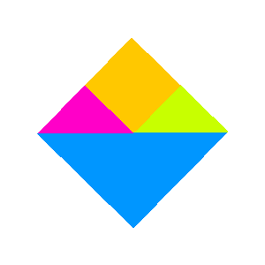

# The retro n-gon renderer

A low-level retro-themed 3D software renderer for the HTML5 \<canvas\> (also supports off-screen rendering).

You can view various interactive render samples [here](https://www.tarpeeksihyvaesoft.com/experimental/retro-ngon/samples/).

\
*An indoor scene from Tomb Raider, with a CRT shader. (Based on assets created by Core Design for Tomb Raider. Core Design is not associated with this renderer.)*

\
*A view of the race track and stands at Rouen in Grand Prix Legends. (Based on textures and 3D models created by Papyrus Design Group for Grand Prix Legends. Papyrus Design Group is not associated with this renderer.)*

\
*A corridor in Quake, with bilinear texture filtering and per-pixel lighting. (Based on textures and 3D models created by id Software for Quake. id Software is not associated with this renderer.)*

## Main features

- Genuine retro aesthetics
- Customizable render pipeline
- Reasonable performance (for retro uses)

## Suggested use cases

Being a retro-oriented software renderer written in JavaScript, the retro n-gon renderer thrives in low resolutions and low polycounts, its performance generally lacking for modern-style rendering.

I'd generally expect the renderer to find a home powering nostalgia projects reminiscent of the 90s and early 2000. Retro-themed games, model visualization, etc.

## Documentation

- [Quick-start guide](#quick-start-guide)
- [API reference](#api-reference)

# Quick-start guide

## Prepare the distributable

1. Install the required developer dependencies:

```bash
$ yarn install
```

These dependencies are needed only to build the distributable. They don't need to be bundled with your application.

2. Build the distributable:

```bash
$ yarn run build
```

3. Optionally, if you know what you're doing, you can build the distributable in developer mode:

```bash
$ yarn run build-dev
```

The developer mode includes additional run-time error checks and data validation, which helps you find bugs at the cost of run-time performance. Keep an eye on your browser's developer console.

## Render a simple quad

1. In your HTML document, create a canvas element:

```html
<canvas id="canvas" style="width: 300px; height: 300px;"></canvas>
```

2. Import the renderer's distributable (which you'll have built by now):

```html
<script src="distributable/rngon.js"></script>
<script>
    // Your JavaScript rendering code can go here.
</script>
```

3. Define a quad and render it onto the canvas:

```javascript
const quad = Rngon.ngon([
    Rngon.vertex(-1, -1, 0),
    Rngon.vertex(1, -1, 0),
    Rngon.vertex(1, 1, 0),
    Rngon.vertex(-1, 1, 0)], {
        color: Rngon.color(0, 150, 255)
});

const quadMesh = Rngon.mesh([quad], {
    rotation: Rngon.vector(0, 0, 45),
});

Rngon.render({
    target: "canvas",
    scene: [quadMesh],
    options: {
        resolution: 1,
        cameraPosition: Rngon.vector(0, 0, -5),
    },
});
```


## Add a texture

1. Define a texture and assign it to the quad:

```javascript
const simpleTexture = Rngon.texture({
    width: 2,
    height: 2,
    pixels: [
        255, 200, 0, 255,
        200, 255, 0, 255,
        255, 0, 200, 255,
        0, 255, 200, 255
    ],
});

const quad = Rngon.ngon([
    Rngon.vertex(-1, -1, 0),
    Rngon.vertex(1, -1, 0),
    Rngon.vertex(1, 1, 0),
    Rngon.vertex(-1, 1, 0)], {
        color: Rngon.color(255, 255, 255),
        texture: simpleTexture,
});
```


2. Optionally, you can load the texture's data from a JSON file:

```javascript
const quad = Rngon.ngon([
    Rngon.vertex(-1, -1, 0),
    Rngon.vertex(1, -1, 0),
    Rngon.vertex(1, 1, 0),
    Rngon.vertex(-1, 1, 0)], {
        color: Rngon.color(255, 255, 255),
        texture: await Rngon.texture.load("texture.json"),
});
```

A PHP-based tool for converting PNG images into this JSON format is provided in the [tools/conversion/](./tools/conversion/) directory.

3. Enable affine texture-mapping by adding vertex UV coordinates and setting the `textureMapping` and `uvWrapping` properties:

```javascript
const quad = Rngon.ngon([
    Rngon.vertex(-1, -1, 0, 0, 0),
    Rngon.vertex( 1, -1, 0, 1, 0),
    Rngon.vertex(1, 1, 0, 1, 1),
    Rngon.vertex(-1, 1, 0, 0, 1)], {
        color: Rngon.color(255, 255, 255),
        texture: simpleTexture,
        textureMapping: "affine",
        uvWrapping: "clamp",
});
```


## Make it pixelated

1. Adjust the `options.resolution` property in the render call:

```javascript
Rngon.render({
    target: "canvas",
    scene: [quadMesh],
    options: {
        resolution: 0.2,
        cameraPosition: Rngon.vector(0, 0, -5),
    },
});
```


2. Modify the canvas's CSS to disable blurry upscaling:

```html
<canvas id="canvas" style="image-rendering: pixelated; width: 300px; height: 300px;"></canvas>
```


## Brief introduction to pixel shaders

1. Enable custom pixel shading by passing a shader function to render():

```javascript
Rngon.render({
    target: "...",
    scene: [...],
    options: {...},
    pipeline: {
        pixelShader: sample_shader,
    },
});

function sample_shader(...)
{
    ...
}
```

2. A pixel shader to make every pixel in the image blue:

```javascript
function sample_shader({renderWidth, renderHeight, pixelBuffer})
{
    for (let i = 0; i < (renderWidth * renderHeight); i++)
    {
        pixelBuffer[(i * 4) + 0] = 0;
        pixelBuffer[(i * 4) + 1] = 150;
        pixelBuffer[(i * 4) + 2] = 255;
        pixelBuffer[(i * 4) + 3] = 255;
    }
}
```


3. A pixel shader to color half of our quad blue:

```javascript
function sample_shader({renderWidth, renderHeight, pixelBuffer, fragmentBuffer})
{
    for (let i = 0; i < (renderWidth * renderHeight); i++)
    {
        if (fragmentBuffer[i]?.worldY < 0))
        {
            pixelBuffer[(i * 4) + 0] = 0;
            pixelBuffer[(i * 4) + 1] = 150;
            pixelBuffer[(i * 4) + 2] = 255;
        }
    }
}
```




## Exporting scenes from Blender

A Python script for exporting scenes from Blender into a JSON format that supports this renderer is provided under [tools/conversion/](./tools/conversion/). At the moment, the export script is rudimentary but does the business.

To export a scene from Blender, load up the export script file in Blender, and run it. The script will export vertex coordinates, vertex UV coordinates, the diffuse color and intensity of each material, and, if any, the filename of the texture image in each material's first texture slot. Objects that are hidden won't be exported.

Remember to first apply any pending transformations to the objects (Object > Apply in Blender's menu) before running the export script, as any unapplied transformations will be ignored. The same goes for any other mesh modifiers that haven't yet been applied.

Once the scene has been exported into the JSON file, you may need to make a few edits to the file by hand. Texture filenames, for example, will probably need to be given correct paths. You'll also want to convert the texture images into the renderer's JSON format (see [Add a texture](#add-a-texture)).

## More!

You can find various render samples under the [samples/](./samples/) directory.

You should also have a look at the [API reference](#api-reference), as it contains much more detail than is found in this quick-start guide. For example, you'll find out about vertex shaders, custom rasterizer functions, raw render buffer access, and many other things.

# API reference

The renderer's public API consists of the following functions:

| Function                                        | Brief description                          |
| ----------------------------------------------- | ------------------------------------------ |
| [render()](#rendertarget-scene-options-pipeline)| Renders meshes.                            |
| [ngon](#ngonvertices-material-normal)           | A polygon with *n* vertices (*n*-gon).     |
| [mesh](#meshngons-transform)                    | A collection of related n-gons.            |
| [vertex](#vertexx-y-z-u-v-w)                    | A corner of an n-gon.                      |
| [vector](#vectorx-y-z)                          | A three-component vector.                  |
| [color](#colorred-green-blue-alpha)             | A 32-bit RGBA color value.                 |
| [texture](#texturedata)                         | A 2D RGBA image for texturing n-gons.      |
| light                                           | (A description is coming.)                 |

All but *`render()`* are factory functions, i.e. their purpose is to construct and return an object based on the input arguments.

The API functions are accessible via the global `Rngon` namespace after you've imported the renderer's script in your application:

```html
<script src="distributable/rngon.js"></script>
<script>
    console.log(Rngon.texture) // ƒ texture(data = {}) ...
</script>
```

## render({target, scene, options, pipeline})

Renders meshes into a 32-bit RGBA pixel buffer, and optionally displays the image on a \<canvas\> element.

(Implemented in [./js/retro-ngon/api/render.js](./js/retro-ngon/api/render.js).)

### Parameters

- **target** (HTMLCanvasElement | string | null = *null*): Destination for the rendered image. Canvas element; `id` attribute of canvas element; or *null* for none. The raw pixel buffer is accessible via `Rngon.state.default.pixelBuffer` after the call.
- **scene** (array = *[mesh()]*): The *`mesh`* objects to be rendered. The array is iterated in back-to-front order.
- **options** (object): Additional rendering options:
    - **resolution** (number | object = *1*): Resolution of the output image. If `target` is HTMLCanvasElement or string, the output resolution is the size of the canvas (according to `window.getComputedStyle`) multiplied by this number, whose range is (0,1]. Otherwise, the value is an object with these properties:
        - **width** (number = *640*): Width in pixels.
        - **height** (number = *480*): Height in pixels.
    - **fov** (number = *43*): Field-of-view size.
    - **useDepthBuffer** (boolean = *true*): Whether to generate a depth buffer to discard occluded pixels. The depth buffer, if generated, is accessible via `Rngon.state.default.depthBuffer` after the call.
    - **hibernateWhenTargetNotVisible** (boolean = *true*): Return without rendering if the target canvas is not within the browser's viewport. Ignored if `target` is *null*.
    - **nearPlane** (number = *1*): Vertices closer to the camera will be clipped.
    - **farPlane** (number = *1000*): Vertices further from the camera will be clipped.
    - **usePerspectiveInterpolation** (boolean = *true*): Whether to apply perspective correction to property interpolation (e.g. texture coordinates) during rasterization.
    - **cameraPosition** (vector = *vector(0, 0, 0)*): The position from which the scene is rendered.
    - **cameraDirection** (vector = *vector(0, 0, 0)*): The direction in which the scene is viewed for rendering.
    - **useFragmentBuffer** (boolean = *false*): Whether to generate a fragment buffer to store per-pixel metadata (e.g. world XYZ coordinates). Automatically enabled if the `options.pixelShader` function accepts a "fragmentBuffer" parameter. The fragment buffer, if generated, is accessible via `Rngon.state.default.fragmentBuffer` after the call.
    - **lights** (array = *[]*): The scene's light sources, as *`light`* objects. N-gons will be lit according to their `material.vertexShading` property.
- **pipeline** (object): Customize the render pipeline:
    - **transformClipLighter** (function | undefined | null = *undefined*): A function to be called by the renderer to transform, clip, and light the input n-gons; or [the built-in function](./js/retro-ngon/default-pipeline/transform-clip-lighter.js) (`Rngon.defaultPipeline.transform_clip_lighter`) if *undefined*; or disabled entirely if *null*.
    - **rasterizer** (function | undefined | null = *undefined*): A function to be called by the renderer to rasterize the input n-gons; or [the built-in function](./js/retro-ngon/default-pipeline/rasterizer.js) (`Rngon.defaultPipeline.rasterizer`) if *undefined*; or disabled entirely if *null*.
    - **surfaceWiper** (function | undefined | null = *undefined*): A function tp be called by the renderer to clear the render surface of previous renderings (pixel colors, depth values, etc.); or [the built-in function](./js/retro-ngon/default-pipeline/surface-wiper.js) (`Rngon.defaultPipeline.surface_wiper`) if *undefined*; or disabled entirely if *null*.
    - **pixelShader** (function | null = *null*): A function to be called by the renderer at the completion of rasterization to apply pixel-shading effects to the rendered image; or disabled if *null*. See the [pixel shader samples](./samples/pixel-shaders/pixel-shaders.js) for examples of usage.
        - Function signature: pixelShader({renderWidth, renderHeight, pixelBuffer, fragmentBuffer, ngonCache, cameraPosition}) {..}. The function returns nothing.
            - **renderWidth** (number): The width of the rendered image.
            - **renderHeight** (number): The height of the rendered image.
            - **pixelBuffer** (Uint8ClampedArray): The pixels of the rendered image (32-bit RGBA).
            - **ngonCache** (array): The screen-space n-gons that were rasterized.
            - **fragmentBuffer** (array): For each pixel in `pixelBuffer`, an object containing metadata about the pixel:
                - **ngonIdx** (number): Index in the `ngonCache` array identifying the pixel's n-gon.
                - **textureUScaled** (number): The U texel coordinate that was used to fetch this pixel. In the range from 0 to the width of the texture.
                - **textureVScaled** (number): The V texel coordinate that was used to fetch this pixel. In the range from 0 to the height of the texture.
                - **textureMipLevelIdx** (number): The texture mip level that was used. A value in the range [0,*n*-1], where *n* is the count of mip levels in the texture.
                - **worldX** (number): World-space X coordinate.
                - **worldY** (number): World-space Y coordinate.
                - **worldZ** (number): World-space Z coordinate.
                - **depth** (number): The depth value written into the depth buffer by this fragment.
                - **shade** (number): The lightness level, in the range [0,1]. 
            - **cameraPosition** (vector): The world-space coordinates from which the scene is being rendered.
        - Note: `options.useFragmentBuffer` must be set to *true* if the pixel shader accesses the fragment buffer. The renderer will in most cases automatically detect this and set the property accordingly, but in some cases you may need to manually assign it.
    - **vertexShader** (function | null = *null*): A function to be called by `pipeline.transformClipLighter` for each of the scene's n-gons, to apply effects to the properties of the n-gon prior to rasterization; or disabled if *null*. The function will be called when the n-gon has been transformed into world-space coordinates. See the [vertex shader samples](./samples/vertex-shaders/vertex-shaders.js) for examples of usage.
        - Function signature: vertexShader(ngon, cameraPosition) {..}. The function returns nothing.
            - **ngon** (*ngon*): The target n-gon, in world-space coordinates and prior to clipping.
            - **cameraPosition** (vector): The world-space coordinates from which the scene is being rendered.

### Returns

An object with the following properties:

- **renderWidth** (number): Width of the output image.
- **renderHeight** (number): Height of the output image.
- **numNgonsRendered** (number): Total count of n-gons rendered. May be smaller than the number of n-gons originally submitted for rendering, due to visibility culling etc.
- **totalRenderTimeMs** (number): Total time it took to complete the render call, in milliseconds.

### Sample usage

```javascript
// Create a mesh out of a quad and render it onto a canvas.

const quad = Rngon.ngon([
    Rngon.vertex(-1, -1, 0),
    Rngon.vertex(1, -1, 0),
    Rngon.vertex(1, 1, 0),
    Rngon.vertex(-1, 1, 0)], {
        color: Rngon.color(255, 255, 0),
});

const mesh = Rngon.mesh([quad], {
    rotation: Rngon.vector(0, 0, 45)
});

Rngon.render({
    target: "canvas",
    scene: [mesh],
    options: {
        cameraPosition: Rngon.vector(0, 0, -5),
    },
});
```

## mesh([ngons[, transform]])

A selection of n-gons related to each other in some way, rendered as a unit with shared transformations.

(Implemented in [./js/retro-ngon/api/mesh.js](./js/retro-ngon/api/mesh.js).)

### Parameters

- **ngons** (array = *[ngon()]*): The n-gons that make up the mesh.
- **transform** (object): Transformations to the mesh's n-gons, to be applied at render-time:
    - **translation** (vector = *vector(0, 0, 0)*): Delta increments to XYZ vertex coordinates.
    - **rotation** (vector = *vector(0, 0, 0)*): Rotation around the origin of (0, 0, 0), in degrees.
        - Note: Rotation is not applied to normals.
    - **scaling** (vector = *vector(1, 1, 1)*): Multipliers to XYZ vertex coordinates.

Note: If both `transform.translation` and `transform.rotation` are given, rotation will be applied first.

### Returns

An object with the following properties:

- **ngons** (array): The `ngons` parameter.
- **translation** (vector): The `transform.translation` parameter.
- **rotation** (vector): The `transform.rotation` parameter.
- **scale** (vector): The `transform.scaling` parameter.

### Sample usage

```javascript
// Construct a mesh containing one n-gon, and apply scaling to it.
const mesh = Rngon.mesh([ngon], {
    scaling: Rngon.vector(10, 15, 5),
});

// Transformations can be edited directly:
mesh.scaling.x = 100;
```

## ngon([vertices[, material[, normal]]])

A polygon made up of *n* vertices, also known as an n-gon. Single-vertex n-gons are treated as points, and two-vertex n-gons as lines.

(Implemented in [./js/retro-ngon/api/ngon.js](./js/retro-ngon/api/ngon.js).)

### Parameters

- **vertices** (array = *[vertex()]*): The *`vertex`* objects that define the corners of the n-gon. The length of the array must be in the range [1,500].
- **material** (object): The material properties that define the n-gon's appearance:
    - **color** (color = *color(255, 255, 255, 255)*): Base color. If the `material.texture` property is *null*, the n-gon will be rendered in this color. Otherwise, the renderer will multiply texel colors by (C / 255), where C is the corresponding channel of the base color.
    - **texture** (texture | null = *null*): The image to be rendered onto the n-gon's face. If *null*, or if there are fewer than 3 vertices, the n-gon will be rendered without a texture.
    - **textureMapping** (string = *"ortho"*): The method by which `material.texture` should be mapped onto the n-gon's face:
        - "ortho": Map by automatically-generated UV coordinates in 2D screen space. Disregards perspective and rotation. UV coordinates provided by the n-gon's *`vertex`* objects are ignored.
        - "affine": Affine texture-mapping using the UV coordinates provided by the n-gon's *`vertex`* objects. For perspective-correct affine mapping, also enable the `options.usePerspectiveInterpolation` property to *`render()`*.
    - **textureFiltering** (string = *"none"*): The filtering effect to be applied when rasterizing `material.texture`:
        - "none": No filtering. The texture will appear pixelated when viewed up close.
        - "dither": Jittering of texel coordinates to approximate bilinear filtering.
    - **uvWrapping** (string = *"repeat"*): How the renderer should scale UV coordinates:
        - "clamp": Clamp UV coordinates to [0,1].
        - "repeat": Discard UV coordinates' integer part. This option is available only for power-of-two textures; others will fall back to "clamp".
    - **hasWireframe** (boolean = *false*): Whether the n-gon should be rendered with a wireframe outline.
        - Also see the `wireframeColor` property.
    - **wireframeColor** (color = *color(0, 0, 0)*): If the `material.hasWireframe` property is *true*, this value sets the wireframe's color.
    - **hasFill** (boolean = *true*): Whether the face of the n-gon should be rendered. If *false* and `material.hasWireframe` is *true*, the n-gon's wireframe outline will be rendered.
    - **isTwoSided** (boolean = *true*): Whether the n-gon should be visible from behind, as determined by the direction of its face normal.
        - Should be set to *true* for n-gons that are part of a *`mesh`* object to which you apply rotation, as rotation doesn't apply to normals.
    - **isInScreenSpace** (boolean = *false*): Whether the XY coordinates of the n-gon's vertices are in screen space. If they are, the renderer won't transform them further (e.g. according to camera position or mesh transformations) before rasterization.
        - If *true*, you must ensure that all vertex XY coordinates are within the boundaries of the rendered image.
    - **vertexShading** (string = *"none"*): The type of shading to be used when applying the scene's light sources to the n-gon:
        - "none": Light sources do not affect the appearance of the n-gon.
        - "flat": The n-gon's face receives a solid shade based on the angle between the incident light and the n-gon's face normal.
        - "gouraud": Same as "flat" but computed per vertex, resulting in smooth shading across the n-gon's face. For this to work, n-gons must have pre-computed smooth vertex normals.
    - **renderVertexShade** (boolean = *true*): Whether the shading values calculated as per the `material.vertexShading` property should be used during rendering. If *false*, this shading information won't directly affect the rendered image, but is accessible to pixel shaders.
    - **allowAlphaBlend** (boolean = *false*): Whether the alpha channel of the `*color` property can modify the appearance of the n-gon. If *true*, the n-gon's pixels will be blended with their background according to the alpha value (0 = fully transparent, 255 = fully opaque).
    - **allowAlphaReject** (boolean = *false*): Whether the alpha channel of the `*color` property can modify the appearance of the n-gon. If *true*, the pixel will be drawn only if the alpha value is 255.
- **normal** (array | vector = *vector(0, 1, 0)*): A vector determining the orientation of the n-gon's face. If given as a *`vector`* object, represents the face normal. If given as an array, each element must be a *`vector`* object that represents the normal of the corresponding vertex in the `vertices` parameter, and in this case the n-gon's face normal will be automatically calculated as the normalized average of these vertex normals.

### Returns

An object with the following properties:

- **vertices** (array): The `vertices` parameter.
- **material** (object): The `material` parameter.
- **vertexNormals** (array): For each element in the `vertices` parameter, a corresponding *`vector`* object determining the normal of the vertex.
- **normal** (vector): The face normal.

### Sample usage

```javascript
// Construct a red line.
const line = Rngon.ngon([
    Rngon.vertex(-1, -1, 0),
    Rngon.vertex( 1, -1, 0)], {
        color: Rngon.color(255, 0, 0),
});
```

## vertex([x[, y[, z[, u[, v]]]]])

A point in space representing a corner of an n-gon.

Note: In the renderer's coordinate space, X is horizontal (positive = right), and Y is vertical (positive = up); positive Z is forward.

(Implemented in [./js/retro-ngon/api/vertex.js](./js/retro-ngon/api/vertex.js).)

### Parameters

- **x** (number = *0*): The X coordinate.
- **y** (number = *0*): The Y coordinate.
- **z** (number = *0*): The Z coordinate.
- **u** (number = *0*): The U texel coordinate.
- **v** (number = *0*): The V texel coordinate.

### Returns

An object with the following properties:

- **x** (number): The `x` parameter.
- **y** (number): The `y` parameter.
- **z** (number): The `z` parameter.
- **u** (number): The `u` parameter.
- **v** (number): The `v` parameter.
- **shade** (number): A positive number defining the vertex's degree of shade, with 0 being fully unlit, 0.5 half lit, and 1 fully lit. The value is computed at render-time.

## vector([x[, y[, z]]])

A three-component vector.

### Parameters

- **x** (number = *0*): The X coordinate.
- **y** (number = *0*): The Y coordinate.
- **z** (number = *0*): The Z coordinate.

### Returns

An object with the following properties:

- **x** (number): The `x` parameter.
- **y** (number): The `y` parameter.
- **z** (number): The `z` parameter.

## color([red[, green[, blue[, alpha]]]])

A 32-bit, four-channel, RGBA color value, where each color channel is 8 bits.

(Implemented in [./js/retro-ngon/api/color.js](./js/retro-ngon/api/color.js).)

### Parameters

- **red** (number = *0*): The red channel.
- **green** (number = *0*): The green channel.
- **blue** (number = *0*): The blue channel.
- **alpha** (number = *255*): The alpha channel.

### Returns

A frozen object with the following properties:

- **red** (number): The `red` parameter.
- **green** (number): The `green` parameter.
- **blue** (number): The `blue` parameter.
- **alpha** (number): The `alpha` parameter.

## texture([data])

A 2D RGBA image for texturing n-gons. Supports 16 and 32-bit input data and generates mipmaps automatically.

Note: Textures with a power-of-two resolution may render faster and support more features than textures that are not a power of two.

(Implemented in [./js/retro-ngon/api/texture.js](./js/retro-ngon/api/texture.js).)

### Parameters

- **data** (object): The texture's data:
    - **width** (number = *0*): The width of the image.
    - **height** (number = *0*): The height of the image.
    - **pixels** (array | string = *[]*): The texture's pixels. The layout of the data is determimned by the `data.channels` property, and the encoding of the data is determined by the `data.encoding` property.
    - **channels** (string = *"rgba:8+8+8+8"*): Specifies the layout of the pixel data:
        - "rgba:5+5+5+1": Each pixel is a 16-bit integer with 5 bits each for red, green, and blue; and 1 bit for alpha.
        - "rgba:8+8+8+8": Each pixel consists of four consecutive 8-bit values for red, green, blue, and alpha.
    - **encoding** (string = *"none"*): Specifies the encoding of the pixel data:
        - "none": The value of the `data.pixels` property is an array, and its elements are numbers according to the `data.channels` property.
        - "base64": The value of the `data.pixels` property is a string representing a Base64-encoded array whose elements are numbers according to the `data.channels` property.

### Returns

An object with the following properties:

- **width** (number): The `data.width` property.
- **height** (number): The `data.height` property.
- **pixels** (Uint8ClampedArray): The decoded pixel data from `data.pixels`, as consecutive RGBA values ([red, green, blue, alpha, red, green, blue, ...]).
- **mipLevels** (array): Downscaled versions of the original image. Each element in the array is an object of the form "{width, height, pixels: [red, green, blue, alpha, red, green, blue, ...]}". The first element is the full-sized image, the second element is half the size of the first, the third half the size of the second, etc., down to an image the size of 1 &times; 1.

### Sample usage

```javascript
// Create a 2-by-2 texture.
const texture = Rngon.texture({
    width: 2,
    height: 2,
    pixels: [
        255, 200, 0, 255,
        200, 255, 0, 255,
        255, 0, 200, 255,
        0, 255, 200, 255
    ],
});
```

```javascript
// Create a texture with the 'data' object loaded from a JSON file.
const texture = await Rngon.texture.load("texture.json");
```

# Authors and credits

The main author of the retro n-gon renderer is the one-man Tarpeeksi Hyvae Soft (see on [GitHub](https://github.com/leikareipa) and the [Web](https://www.tarpeeksihyvaesoft.com)).

On 3D software rendering in general, the aforementioned main author has benefited a good bit from tutorials by Benny Bobaganoosh. You can check out his [YouTube](https://www.youtube.com/playlist?list=PLEETnX-uPtBUbVOok816vTl1K9vV1GgH5) and [GitHub](https://github.com/BennyQBD/3DSoftwareRenderer). The retro n-gon renderer's matrix code ([js/retro-ngon/core/matrix44.js](./js/retro-ngon/core/matrix44.js)) is adapted, with superficial changes, from [Benny's code](https://github.com/BennyQBD/3DSoftwareRenderer/blob/master/src/Matrix4f.java).
